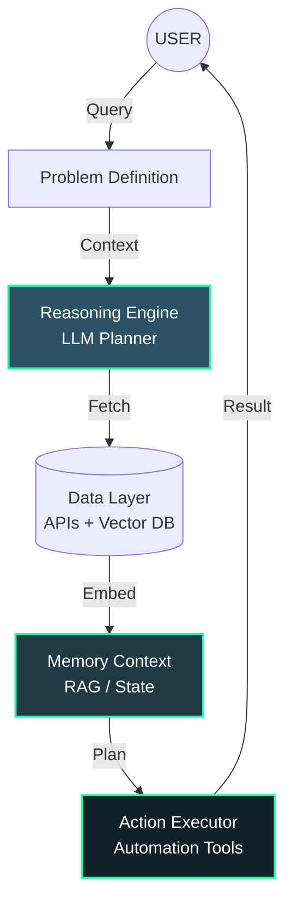

<!-- ========================================================= -->
<!--                     HERO HEADER                            -->
<!-- ========================================================= -->

<p align="center">
  
</p>

<p align="center">
  
</p>

<p align="center">
  
  
  
  
</p>

---

# ⚡ SYSTEM STATUS: ONLINE

<table>
<tr>
<td width="50%" valign="top">

```bash
> ./init_profile.sh --verbose

[LOADING] Identity Module... OK
[NAME]    Mahmud Al Muhaimin
[ROLE]    AI Engineer
[FOCUS]   Autonomous Systems
[STATUS]  Building intelligent machines

> executing main_loop...
> loading projects...
> initializing AI architecture...
> SYSTEM READY.
```

</td>
<td width="50%" valign="top">

### `class AI_Engineer:`

I build **AI systems that reason, remember, and act**.

Moving beyond static applications, my work focuses on:

- 🤖 **Autonomous Agents**: Self-directing workflows
- ⚙️ **Intelligent Pipelines**: Automated reasoning loops
- 🧠 **ML Systems**: Custom model integration
- 🚀 **DevTools**: AI-powered productivity enhancers

`return "Software that thinks before it executes."`

</td>
</tr>
</table>

---

# 🧠 ARCHITECTURE BLUEPRINT

<p align="center">
  <i>The underlying logic of the autonomous systems I design.</i>
</p>



---

# 🚀 DEPLOYED SYSTEMS

<table>
<tr>
<td width="50%">

### 🎧 `Podcast_AI_Assistant`
*Transforming audio into structured knowledge graphs.*

```python
def process_podcast(audio):
    text = stt.transcribe(audio)
    summary = llm.summarize(text)
    return InteractiveQA(summary)
```

- 📝 Speech-to-text transcription
- 📄 AI-generated summaries
- 💬 Interactive Q&A interface

</td>
<td width="50%">

### 🌍 `Travel_Agent_Autonomous`
*Intelligent itinerary planning via API aggregation.*

```python
def plan_trip(preferences):
    data = aggregate_apis(preferences)
    itinerary = optimizer.generate(data)
    return personalized_recommendations(itinerary)
```

- 🗺️ Smart itinerary generation
- 🎯 Personalized recommendations
- 🔗 Multi-source API aggregation

</td>
</tr>
<tr>
<td width="50%">

### 🤖 `SEO_Agent_SelfImproving`
*Autonomous content optimization loop.*

```python
while ranking < target:
    insights = analyze_serp(keyword)
    content = generate_optimized(insights)
    deploy(content)
    rank = monitor_performance()
```

- 📊 SERP analysis & insight extraction
- ✍️ SEO-optimized content generation
- 🔄 Feedback loop integration

</td>
<td width="50%">

### 🧠 `Research_Agent_Core`
*Automating knowledge discovery pipelines.*

```python
def research(topic):
    sources = search_web(topic)
    insights = extract_key_data(sources)
    return summarize_findings(insights)
```

- 🔍 Automated research workflows
- 📑 AI-driven summarization
- 💡 Insight extraction & reporting

</td>
</tr>
</table>

---

# 📊 TELEMETRY DATA

<p align="center">
  <b>> fetching real-time development metrics...</b>
</p>

<p align="center">
  
  
</p>

<p align="center">
  
</p>

---

# 🧪 ACTIVE RESEARCH MODULES

> `// Currently experimenting with next-gen autonomous architectures`

<table>
<tr>
<td width="50%">

- 🤖 **Autonomous AI Agents**
  - *Multi-agent orchestration*
  - *Self-correction mechanisms*

- 🧠 **Self-Improving Systems**
  - *Recursive prompt optimization*
  - *Feedback-loop learning*

</td>
<td width="50%">

- 🚀 **AI-Powered SaaS**
  - *Scalable inference pipelines*
  - *User-centric AI interfaces*

- ⚙️ **Workflow Automation**
  - *No-code/Low-code AI integrations*
  - *Event-driven agent triggers*

</td>
</tr>
</table>

---

# 🧩 CONTRIBUTION HEATMAP

<p align="center">
  
</p>

---

# 🌐 ESTABLISH CONNECTION

<p align="center">
  <a href="https://github.com/m-Muhaimin">
    
  </a>
  <a href="https://linkedin.com/in/mahmud-al-muhaimin">
    
  </a>
</p>

---

# ⚡ ENGINEERING PHILOSOPHY

<p align="center">

```diff
+ Good software follows instructions.
+ Intelligent software understands context.
- The future belongs to autonomous systems.
```

</p>
