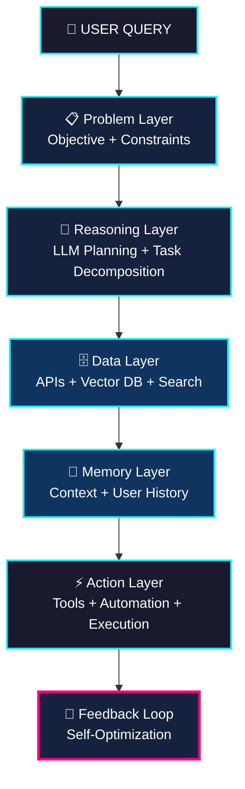

<!-- ========================================================= -->
<!--           CYBERPUNK AI COMMAND CENTER v2.1                -->
<!--           Mahmud Al Muhaimin | m-Muhaimin                 -->
<!-- ========================================================= -->

<p align="center">
  
</p>

<p align="center">
  
</p>

---

<p align="center">
  
  
  
  
  
  
</p>

<p align="center">
  
  
  
  
  
  
</p>

---

# ⚡ Welcome to My AI Command Center

```bash
> initializing neural interface...
> user: Mahmud Al Muhaimin
> role: AI Systems Architect @ SuprBuild
> location: Dhaka, Bangladesh 🇧🇩
> mission: Build agents that reason, remember, act
> status: 🟢 ONLINE | Building autonomous intelligence
> response_time: May be slow (deep work mode)
```

I engineer **autonomous AI systems** that don't just respond—they *anticipate*, *plan*, and *execute*.

Instead of building simple chatbots, I create **intelligent agents** with:
- 🧠 **Reasoning layers** powered by LLMs
- 🗄️ **Memory systems** for persistent context
- 🔗 **Data pipelines** connecting APIs & vector DBs
- ⚙️ **Automation workflows** that take real actions

> 🎯 **Current Focus**: Multi-agent orchestration • Self-improving systems • AI-powered SaaS

---

# 🧬 My AI Agent Architecture

Every system I design follows this **5-layer autonomous architecture**:



This transforms AI from **passive chatbots → autonomous agents** that execute complex workflows.

---

# 🚀 Featured AI Systems

## 🎧 AI Podcast Learning Assistant
**Stack**: Python • Whisper • RAG • Vector DB  
An intelligent system that converts podcasts into structured knowledge bases.

✨ **Capabilities**:
- Speech-to-text transcription
- AI-generated summaries & key insights
- Question answering over podcast content
- Automatic knowledge extraction

🔗 [`podcast-transcriber-api`](https://github.com/m-Muhaimin/podcast-transcriber-api )

---

## 🤖 Autonomous SEO Agent
**Stack**: LangChain • LLM • Analytics API  
A self-optimizing content system that improves based on performance data.

🔄 **Workflow**:
1. Analyzes search results & competitor content
2. Extracts insights from top-ranking pages
3. Generates SEO-optimized articles
4. Monitors analytics & self-improves

🔗 [`AI-Blog-Assistant`](https://github.com/m-Muhaimin/AI-Blog-Assistant )

---

## 💬 BeebotUI - Modern AI Chat Interface
**Stack**: TypeScript • React • Tailwind CSS  
A sleek, modern chatbot UI with enhanced user experience.

🎨 **Features**:
- Clean, responsive design
- Real-time streaming responses
- Conversation history management

🔗 [`beebotUI`](https://github.com/m-Muhaimin/beebotUI )

---

## 🔍 Deep Skeedo - AI Search Engine
**Stack**: TypeScript • Firecrawl • Real-time Citations  
Open-source Perplexity-like search with live data & citations.

⚡ **Powered by**:
- Real-time web scraping via Firecrawl
- Streaming AI responses
- Live citation generation

🔗 [`deep-skeedo`](https://github.com/m-Muhaimin/deep-skeedo )

---

# 🧪 Current Experiments

| Project | Status | Description |
|---------|--------|-------------|
| ️ **SuprBuild** | 🟢 Active | Next-gen build automation platform |
| 🧠 **Multi-Agent Orchestrator** | 🟡 Beta | Coordinating multiple AI agents |
| 📈 **Self-Improving SEO System** | 🟢 Live | A/B testing + auto-optimization |
| 🎯 **AI-Powered SaaS** | 🔴 Planning | Cognitive intelligence for e-commerce |

---

# 📊 System Analytics

<p align="center">
  
  
</p>

<p align="center">
  
</p>

---

# 🧭 Engineering Philosophy

> 💡 **Good software follows instructions.**  
> 🧠 **Intelligent software understands context.**  
> 🚀 **The future belongs to autonomous systems.**

I believe in building AI that:
- ✅ **Reasons** through complex problems
- ✅ **Remembers** context across interactions
- ✅ **Acts** autonomously to achieve goals
- ✅ **Learns** from feedback loops

---

# 🌐 Connect With Me

<p align="center">
  <a href="https://github.com/m-Muhaimin " target="_blank">
    
  </a>
  <a href="https://linkedin.com/in/mahmud-al-muhaimin " target="_blank">
    
  </a>
  <a href="mailto:hi@muhaimin.dev">
    
  </a>
  <a href="https://muhaimin.dev " target="_blank">
    
  </a>
  <a href="https://twitter.com/MMuhaminn " target="_blank">
    
  </a>
</p>

---

<p align="center">
  <sub>Built with ⚡ by <strong>Mahmud Al Muhaimin</strong> | © 2026</sub><br/>
  <sub>🤖 Autonomous AI Systems | 🧠 Reasoning Engines | 🚀 The Future is Agentic</sub>
</p>

<!-- Made with 🔥 Cyberpunk AI Template -->
