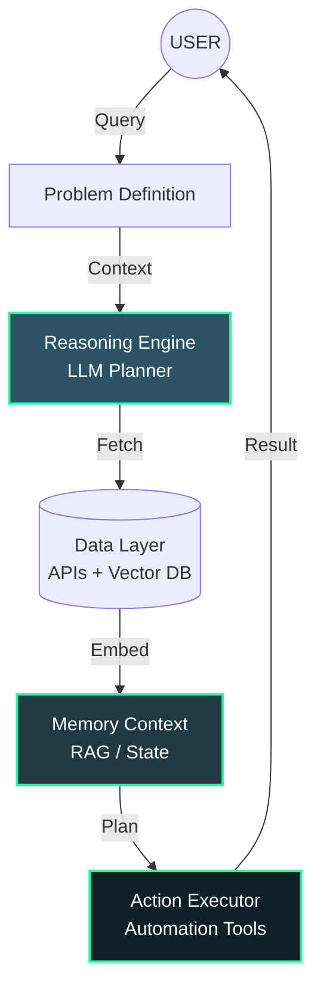

<!-- ========================================================= -->
<!--                     HERO HEADER                            -->
<!-- ========================================================= -->

<p align="center">
  
</p>

<p align="center">
  
</p>

<p align="center">
  
  
  
  
</p>

---

# ⚡ SYSTEM STATUS: ONLINE

<table>
<tr>
<td width="50%" valign="top">

```bash
> ./init_profile.sh --verbose

[LOADING] Identity Module... OK
[NAME]    Mahmud Al Muhaimin
[ROLE]    AI Engineer
[FOCUS]   Autonomous Systems
[STATUS]  Building intelligent machines

> executing main_loop...
> loading projects...
> initializing AI architecture...
> SYSTEM READY.
```

</td>
<td width="50%" valign="top">

### `class AI_Engineer:`

I build **AI systems that reason, remember, and act**.

Moving beyond static applications, my work focuses on:

- 🤖 **Autonomous Agents**: Self-directing workflows
- ⚙️ **Intelligent Pipelines**: Automated reasoning loops
- 🧠 **ML Systems**: Custom model integration
- 🚀 **DevTools**: AI-powered productivity enhancers

`return "Software that thinks before it executes."`

</td>
</tr>
</table>

---

# 🧠 ARCHITECTURE BLUEPRINT

<p align="center">
  <i>The underlying logic of the autonomous systems I design.</i>
</p>



---

# 🚀 DEPLOYED SYSTEMS

<table>
<tr>
<td width="33%" valign="top">

### 🎧 `Podcast_AI`
*Audio to Knowledge Graph*

```python
def process(audio):
    text = stt.transcribe(audio)
    return llm.summarize(text)
```

- 📝 STT Transcription
- 📄 AI Summaries
- 💬 Interactive Q&A

</td>
<td width="33%" valign="top">

### 🌍 `Travel_Agent`
*Smart Itinerary Planner*

```python
def plan(prefs):
    data = aggregate_apis(prefs)
    return optimizer.generate(data)
```

- 🗺️ Smart Itineraries
- 🎯 Personalization
- 🔗 API Aggregation

</td>
<td width="33%" valign="top">

### 🤖 `SEO_Agent`
*Self-Improving Loop*

```python
while rank < target:
    insights = analyze_serp()
    content = generate(insights)
    deploy(content)
```

- 📊 SERP Analysis
- ✍️ Content Gen
- 🔄 Feedback Loop

</td>
</tr>
<tr>
<td width="33%" valign="top">

### 🧠 `Research_Core`
*Knowledge Discovery*

```python
def research(topic):
    sources = search_web(topic)
    return extract_insights(sources)
```

- 🔍 Auto-Research
- 📑 Summarization
- 💡 Insight Extraction

</td>
<td width="33%" valign="top">

### 🛠️ `DevTools_AI`
*Productivity Enhancers*

```python
def assist(code):
    context = analyze_repo()
    return suggest_refactor(context)
```

- 💻 Code Completion
- 🐛 Bug Detection
- 📚 Doc Generation

</td>
<td width="33%" valign="top">

### 🔄 `Auto_Pipelines`
*Workflow Automation*

```python
def run_pipeline(event):
    trigger = detect_event(event)
    execute_agent_chain(trigger)
```

- ⚡ Event-Driven
- 🔗 Chain Logic
- 📉 Error Handling

</td>
</tr>
</table>

---

# 📊 TELEMETRY DATA

<p align="center">
  <b>> fetching real-time development metrics...</b>
</p>

<p align="center">
  
  
</p>

<p align="center">
  
</p>

---

# 🧪 ACTIVE RESEARCH MODULES

> `// Currently experimenting with next-gen autonomous architectures`

<table>
<tr>
<td width="33%" valign="top">

- 🤖 **Autonomous Agents**
  - *Multi-agent orchestration*
  - *Self-correction mechanisms*

</td>
<td width="33%" valign="top">

- 🧠 **Self-Improving AI**
  - *Recursive prompt opt.*
  - *Feedback-loop learning*

</td>
<td width="33%" valign="top">

- 🚀 **AI SaaS & Auto**
  - *Scalable inference*
  - *Event-driven triggers*

</td>
</tr>
</table>

---

# 🧩 CONTRIBUTION HEATMAP

<p align="center">
  
</p>

---

# 🌐 ESTABLISH CONNECTION

<p align="center">
  <a href="https://github.com/m-Muhaimin">
    
  </a>
  <a href="https://linkedin.com/in/mahmud-al-muhaimin">
    
  </a>
</p>

---

# ⚡ ENGINEERING PHILOSOPHY

<p align="center">

```diff
+ Good software follows instructions.
+ Intelligent software understands context.
- The future belongs to autonomous systems.
```

</p>
